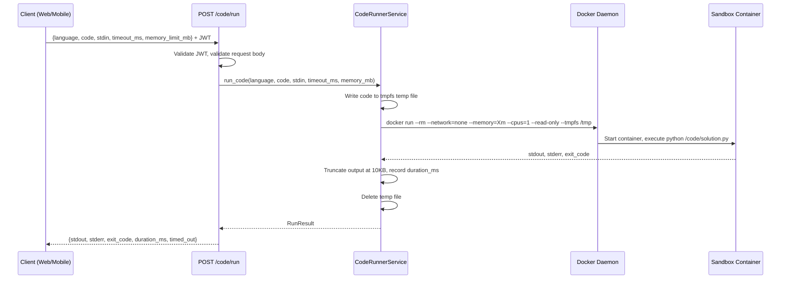
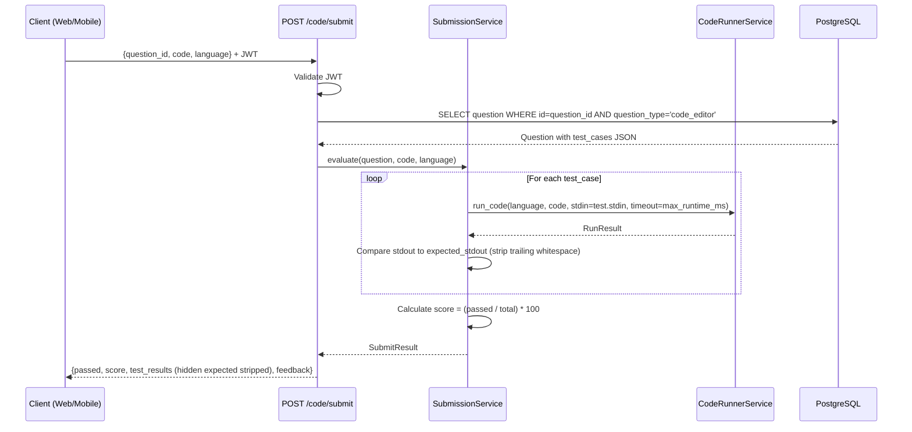

# Design Document: Code Runner Assignments

## Overview

This feature adds a VS Code-like coding assignment experience to the Coderun platform. Students write Python code in a Monaco editor, run it against a sandboxed Docker executor, and submit for automated test-case evaluation. The implementation extends the existing `code_editor` question type across backend, web, and mobile without breaking any existing functionality.

The system is composed of four layers: a secure Docker-based code execution service, a FastAPI backend with two new endpoints, a Next.js web component with Monaco editor, and a Flutter mobile widget. All code execution is isolated in ephemeral containers with no network access, enforced CPU/memory/timeout limits, and output truncation.

## Architecture

```mermaid
graph TD
    subgraph "Web (Next.js)"
        WEB_COMP[CodeRunnerAssignment\nComponent]
        WEB_API[code-api.ts]
    end

    subgraph "Mobile (Flutter)"
        MOB_WIDGET[CodeAssignmentWidget]
        MOB_REPO[CodeRunnerRepository]
    end

    subgraph "Backend (FastAPI)"
        ROUTER[/api/v1/code/run\n/api/v1/code/submit]
        CR_SVC[CodeRunnerService]
        SUB_SVC[SubmissionService]
        DB[(PostgreSQL\nquestions table)]
    end

    subgraph "Execution Layer"
        DOCKER[Docker Daemon]
        SANDBOX[python:3.11-slim\nSandbox Container\n--network=none\n--memory=128m\n--cpus=1\n--read-only]
    end

    WEB_COMP --> WEB_API
    WEB_API -->|JWT| ROUTER
    MOB_WIDGET --> MOB_REPO
    MOB_REPO -->|JWT| ROUTER
    ROUTER --> CR_SVC
    ROUTER --> SUB_SVC
    SUB_SVC --> DB
    CR_SVC --> DOCKER
    DOCKER --> SANDBOX
    SANDBOX -->|stdout/stderr| CR_SVC
```

## Data Flow

### Run Code Flow



### Submit Code Flow



## Security Boundary

```mermaid
graph LR
    subgraph "Host OS"
        subgraph "Docker Network (none)"
            CONT[Sandbox Container\nNo internet\nNo host FS\nRead-only rootfs\n/tmp tmpfs only]
        end
        DAEMON[Docker Daemon]
        TMPFS[/tmp/coderun_XXXX\ntmpfs — auto-deleted]
    end
    DAEMON -->|mount read-only| CONT
    TMPFS -->|code file| CONT
```

**Docker flags used:**
```
docker run --rm \
  --network=none \
  --memory=128m \
  --cpus=1 \
  --read-only \
  --tmpfs /tmp:size=32m \
  python:3.11-slim \
  python /tmp/solution.py
```

## Backend Design

### New File: `backend/app/schemas/code_runner.py`

Pydantic models for the two new endpoints.

```python
from pydantic import BaseModel, Field

class CodeRunRequest(BaseModel):
    language: str = "python"
    code: str = Field(..., max_length=50_000)
    stdin: str = ""
    assignment_id: str | None = None
    timeout_ms: int = Field(default=5000, ge=1000, le=30_000)
    memory_limit_mb: int = Field(default=128, ge=64, le=512)

class CodeRunResponse(BaseModel):
    stdout: str
    stderr: str
    exit_code: int
    duration_ms: int
    timed_out: bool

class TestCaseResult(BaseModel):
    name: str
    passed: bool
    stdout: str
    stderr: str
    duration_ms: int
    hidden: bool
    expected_stdout: str | None  # None when hidden=True

class CodeSubmitRequest(BaseModel):
    question_id: str
    code: str = Field(..., max_length=50_000)
    language: str = "python"

class CodeSubmitResponse(BaseModel):
    passed: bool
    score: int
    stdout: str
    stderr: str
    test_results: list[TestCaseResult]
    feedback: str
```

### New File: `backend/app/services/code_runner_service.py`

```python
# Key algorithm — run_code()
# PRECONDITIONS:
#   - language in SUPPORTED_LANGUAGES
#   - len(code) <= 50_000
#   - 1000 <= timeout_ms <= 30_000
#   - 64 <= memory_mb <= 512
# POSTCONDITIONS:
#   - Returns CodeRunResponse
#   - Temp file is always deleted (finally block)
#   - Container is always removed (--rm flag)
#   - stdout + stderr combined <= 10KB

async def run_code(language, code, stdin, timeout_ms, memory_mb) -> CodeRunResponse:
    # 1. Check Docker availability → raise HTTP 503 if unavailable
    # 2. Write code to temp file in /tmp/coderun_{uuid}/solution.py
    # 3. Build docker run command with security flags
    # 4. asyncio.create_subprocess_exec() with timeout = timeout_ms / 1000
    # 5. communicate() with timeout → catch asyncio.TimeoutError
    # 6. Truncate stdout+stderr at OUTPUT_LIMIT_KB (10KB)
    # 7. Delete temp directory (finally)
    # 8. Return CodeRunResponse

# Key algorithm — evaluate_submission()
# PRECONDITIONS:
#   - question.question_type == 'code_editor'
#   - question.test_cases is not None and len > 0
# POSTCONDITIONS:
#   - All test cases executed
#   - hidden test cases have expected_stdout=None in response
#   - score = floor((passed / total) * 100)

async def evaluate_submission(question, code, language) -> CodeSubmitResponse:
    # 1. Parse test_cases JSON from question
    # 2. For each test_case: call run_code(language, code, stdin=test.stdin, ...)
    # 3. Compare actual stdout.strip() == expected_stdout.strip()
    # 4. Build TestCaseResult list (strip expected_stdout if hidden)
    # 5. Calculate score and passed flag
    # 6. Generate feedback string based on score
    # 7. Return CodeSubmitResponse
```

### New File: `backend/app/api/v1/endpoints/code_runner.py`

```python
router = APIRouter(prefix="/code", tags=["code-runner"])

@router.post("/run", response_model=CodeRunResponse)
async def run_code_endpoint(
    request: CodeRunRequest,
    current_user: User = Depends(get_current_user),
    service: CodeRunnerService = Depends(get_code_runner_service),
):
    # Delegates to service.run_code()
    # Logs: user_id, timestamp, language, code length

@router.post("/submit", response_model=CodeSubmitResponse)
async def submit_code_endpoint(
    request: CodeSubmitRequest,
    current_user: User = Depends(get_current_user),
    db: AsyncSession = Depends(get_db),
    service: CodeRunnerService = Depends(get_code_runner_service),
):
    # 1. Fetch question by request.question_id
    # 2. Validate question_type == 'code_editor'
    # 3. Validate test_cases not empty → HTTP 422
    # 4. Delegates to service.evaluate_submission()
```

### Modified File: `backend/app/models/question.py`

Add 6 new nullable columns after the existing `is_reinforcement` column:

```python
from sqlalchemy import Text

# New columns to add to Question model
language: Mapped[str | None] = mapped_column(
    String, nullable=True, server_default="python"
)
starter_code: Mapped[str | None] = mapped_column(Text, nullable=True)
test_cases: Mapped[list[dict] | None] = mapped_column(JSON, nullable=True)
assignment_instructions: Mapped[str | None] = mapped_column(Text, nullable=True)
max_runtime_ms: Mapped[int | None] = mapped_column(
    Integer, nullable=True, server_default="5000"
)
memory_limit_mb: Mapped[int | None] = mapped_column(
    Integer, nullable=True, server_default="128"
)
```

### Modified File: `backend/app/schemas/question.py`

Extend `QuestionSimpleResponse`, `QuestionCreateSchema`, and `QuestionUpdateSchema`:

```python
# Add to QuestionSimpleResponse (and thus QuestionResponse):
language: str | None = None
starter_code: str | None = None
test_cases: list[dict] | None = None
assignment_instructions: str | None = None
max_runtime_ms: int | None = None
memory_limit_mb: int | None = None

# Add to QuestionCreateSchema:
language: str | None = None
starter_code: str | None = None
test_cases: list[dict] | None = None
assignment_instructions: str | None = None
max_runtime_ms: int | None = None
memory_limit_mb: int | None = None

# Add to QuestionUpdateSchema (all optional):
language: str | None = None
starter_code: str | None = None
test_cases: list[dict] | None = None
assignment_instructions: str | None = None
max_runtime_ms: int | None = None
memory_limit_mb: int | None = None
```

### Modified File: `backend/app/api/v1/router.py`

```python
from app.api.v1.endpoints import (
    admin, ai, auth, gamification, lessons,
    mentor, modules, placement, code_runner  # add code_runner
)

api_router.include_router(code_runner.router)  # add this line
```

### Modified File: `backend/app/core/config.py`

```python
# Add to Settings class:
CODE_RUNNER_TIMEOUT_MS: int = 5000
CODE_RUNNER_MEMORY_MB: int = 128
CODE_RUNNER_OUTPUT_LIMIT_KB: int = 10
CODE_RUNNER_DOCKER_IMAGE: str = "python:3.11-slim"
```

### New File: `backend/alembic/versions/XXXX_add_code_assignment_fields.py`

```python
"""add_code_assignment_fields

Revision ID: <auto-generated>
Revises: b57f111aeb2e
Create Date: <auto-generated>
"""

def upgrade() -> None:
    op.add_column('questions', sa.Column('language', sa.String(), nullable=True,
                  server_default='python'))
    op.add_column('questions', sa.Column('starter_code', sa.Text(), nullable=True))
    op.add_column('questions', sa.Column('test_cases', postgresql.JSON(), nullable=True))
    op.add_column('questions', sa.Column('assignment_instructions', sa.Text(), nullable=True))
    op.add_column('questions', sa.Column('max_runtime_ms', sa.Integer(), nullable=True,
                  server_default='5000'))
    op.add_column('questions', sa.Column('memory_limit_mb', sa.Integer(), nullable=True,
                  server_default='128'))

def downgrade() -> None:
    op.drop_column('questions', 'memory_limit_mb')
    op.drop_column('questions', 'max_runtime_ms')
    op.drop_column('questions', 'assignment_instructions')
    op.drop_column('questions', 'test_cases')
    op.drop_column('questions', 'starter_code')
    op.drop_column('questions', 'language')
```

## Test Case JSON Schema

Test cases are stored in the `test_cases` column as a JSON array. Each entry follows this shape:

```json
[
  {
    "name": "Basic test",
    "stdin": "",
    "expected_stdout": "Hello, Coderun!",
    "hidden": false
  },
  {
    "name": "Hidden edge case",
    "stdin": "5",
    "expected_stdout": "25",
    "hidden": true
  }
]
```

**Comparison rule:** `actual_stdout.strip() == expected_stdout.strip()` — trailing newlines and whitespace are ignored.

**Hidden test protection:** When `hidden: true`, the `expected_stdout` field is set to `null` in `TestCaseResult` before the response is serialized. The `name` field is still returned so the student knows a hidden test exists.

## Web Frontend Design

### Component Layout

```
┌─────────────────────────────────────────────────────────────┐
│  [🐍 Python]  Assignment Title          [Run ▶] [Submit ✓] [Reset ↺] │
├──────────────────┬──────────────────────────────────────────┤
│                  │                                           │
│  Instructions    │   Monaco Editor                           │
│  Panel           │   - language: python                      │
│  (left, 30%)     │   - theme: vs-dark                        │
│                  │   - fontSize: 14                          │
│  Scrollable      │   - minimap: disabled                     │
│  markdown-like   │   - starter_code pre-loaded               │
│  text            │   (center, 70%)                           │
│                  ├──────────────────────────────────────────┤
│                  │   Terminal Output                         │
│                  │   - stdout: white monospace               │
│                  │   - stderr: red monospace                 │
│                  │   - duration badge                        │
│                  │   - "Timed out" banner if timed_out       │
│                  │   (bottom panel, ~200px)                  │
├──────────────────┴──────────────────────────────────────────┤
│  Ghostie Panel: [state] + message                           │
│  Test Results List (visible after submit)                   │
└─────────────────────────────────────────────────────────────┘
```

### New File: `web/coderun-web/src/lib/api/code-api.ts`

```typescript
import axiosClient from './axios-client';
import type { CodeRunRequest, CodeRunResponse, CodeSubmitRequest, CodeSubmitResponse } from '@/lib/types/code-runner.types';

export const codeApi = {
  async runCode(request: CodeRunRequest): Promise<CodeRunResponse> {
    const response = await axiosClient.post('/code/run', request);
    return response.data;
  },

  async submitCode(request: CodeSubmitRequest): Promise<CodeSubmitResponse> {
    const response = await axiosClient.post('/code/submit', request);
    return response.data;
  },
};
```

### New File: `web/coderun-web/src/lib/types/code-runner.types.ts`

```typescript
export interface CodeRunRequest {
  language: string;
  code: string;
  stdin?: string;
  timeoutMs?: number;
  memoryLimitMb?: number;
}

export interface CodeRunResponse {
  stdout: string;
  stderr: string;
  exitCode: number;
  durationMs: number;
  timedOut: boolean;
}

export interface TestCaseResult {
  name: string;
  passed: boolean;
  stdout: string;
  stderr: string;
  durationMs: number;
  hidden: boolean;
  expectedStdout: string | null;
}

export interface CodeSubmitRequest {
  questionId: string;
  code: string;
  language: string;
}

export interface CodeSubmitResponse {
  passed: boolean;
  score: number;
  stdout: string;
  stderr: string;
  testResults: TestCaseResult[];
  feedback: string;
}
```

### New File: `web/coderun-web/src/components/lesson/code-runner-assignment.tsx`

```typescript
'use client';

// Monaco must be dynamically imported with ssr: false to avoid SSR errors
const MonacoEditor = dynamic(() => import('@monaco-editor/react'), { ssr: false });

// Component state machine:
// idle → running (Run clicked) → idle (result received)
// idle → submitting (Submit clicked) → idle (result received)

type EditorState = 'idle' | 'running' | 'submitting';

interface CodeRunnerAssignmentProps {
  question: QuestionResponse;  // question.questionType === 'code_editor'
  currentAnswer: string;
  onChange: (answer: string) => void;
}

// Ghostie state mapping:
// idle → GhostieState.idle
// running → GhostieState.idle (no "thinking" state; show spinner overlay instead)
// stderr non-empty after run → GhostieState.sad_wrong
// timed_out → GhostieState.angry
// submit passed=true → GhostieState.very_happy
// submit passed=false → GhostieState.sad_wrong

// Key behaviors:
// - Reset button restores question.starterCode to editor
// - Run button calls codeApi.runCode() and shows output in terminal panel
// - Submit button calls codeApi.submitCode() and shows TestResultsList
// - Editor value is kept in local state; onChange called on every change
//   so lesson flow can track "has answer" (non-empty code = has answer)
```

### Modified File: `web/coderun-web/src/components/lesson/question-router.tsx`

Replace the `code_editor` case:

```typescript
// Before:
case 'code_editor':
  return <MiniProjectQuestion question={question} currentAnswer={currentAnswer} onChange={onAnswer} />;

// After:
case 'code_editor':
  return <CodeRunnerAssignment question={question} currentAnswer={currentAnswer} onChange={onAnswer} />;
```

### Modified File: `web/coderun-web/src/lib/types/module.types.ts`

Extend `QuestionResponse`:

```typescript
export interface QuestionResponse {
  // ... existing fields ...
  language: string | null;
  starterCode: string | null;
  testCases: Array<{ name: string; stdin: string; expectedStdout: string; hidden: boolean }> | null;
  assignmentInstructions: string | null;
  maxRuntimeMs: number | null;
  memoryLimitMb: number | null;
}
```

### Modified File: `web/coderun-web/src/lib/api/module-api.ts`

Extend `mapQuestion()`:

```typescript
function mapQuestion(raw: any): QuestionResponse {
  return {
    // ... existing fields ...
    language: raw.language ?? null,
    starterCode: raw.starter_code ?? null,
    testCases: raw.test_cases ?? null,
    assignmentInstructions: raw.assignment_instructions ?? null,
    maxRuntimeMs: raw.max_runtime_ms ?? null,
    memoryLimitMb: raw.memory_limit_mb ?? null,
  };
}
```

## Mobile Design

### Modified File: `mobile/coderun_mobile/lib/data/models/question_model.dart`

Add new fields and regenerate `.g.dart`:

```dart
@JsonSerializable()
class QuestionModel {
  // ... existing fields ...

  final String? language;
  @JsonKey(name: 'starter_code')
  final String? starterCode;
  @JsonKey(name: 'test_cases')
  final List<Map<String, dynamic>>? testCases;
  @JsonKey(name: 'assignment_instructions')
  final String? assignmentInstructions;
  @JsonKey(name: 'max_runtime_ms')
  final int? maxRuntimeMs;
  @JsonKey(name: 'memory_limit_mb')
  final int? memoryLimitMb;
}
```

After adding fields, run: `dart run build_runner build --delete-conflicting-outputs`

### New File: `mobile/coderun_mobile/lib/data/models/code_run_result_model.dart`

```dart
@JsonSerializable()
class CodeRunResultModel {
  final String stdout;
  final String stderr;
  @JsonKey(name: 'exit_code')
  final int exitCode;
  @JsonKey(name: 'duration_ms')
  final int durationMs;
  @JsonKey(name: 'timed_out')
  final bool timedOut;
}

@JsonSerializable()
class TestCaseResultModel {
  final String name;
  final bool passed;
  final String stdout;
  final String stderr;
  @JsonKey(name: 'duration_ms')
  final int durationMs;
  final bool hidden;
  @JsonKey(name: 'expected_stdout')
  final String? expectedStdout;
}

@JsonSerializable()
class CodeSubmitResultModel {
  final bool passed;
  final int score;
  final String stdout;
  final String stderr;
  @JsonKey(name: 'test_results')
  final List<TestCaseResultModel> testResults;
  final String feedback;
}
```

### New File: `mobile/coderun_mobile/lib/data/repositories/code_runner_repository.dart`

```dart
class CodeRunnerRepository {
  final Dio _dio;

  Future<CodeRunResultModel> runCode({
    required String language,
    required String code,
    String stdin = '',
    int timeoutMs = 5000,
    int memoryLimitMb = 128,
  }) async {
    final response = await _dio.post('/api/v1/code/run', data: {
      'language': language,
      'code': code,
      'stdin': stdin,
      'timeout_ms': timeoutMs,
      'memory_limit_mb': memoryLimitMb,
    });
    return CodeRunResultModel.fromJson(response.data);
  }

  Future<CodeSubmitResultModel> submitCode({
    required String questionId,
    required String code,
    required String language,
  }) async {
    final response = await _dio.post('/api/v1/code/submit', data: {
      'question_id': questionId,
      'code': code,
      'language': language,
    });
    return CodeSubmitResultModel.fromJson(response.data);
  }
}
```

### New File: `mobile/coderun_mobile/lib/presentation/screens/lesson/widgets/code_assignment_widget.dart`

```dart
// Widget layout:
// SingleChildScrollView
//   └── Column
//       ├── Card(Text(assignmentInstructions))   // instructions
//       ├── Container(TextField(monospace, multiline, minLines: 10))  // code editor
//       ├── Row([RunButton, SubmitButton, ResetButton])
//       ├── TerminalCard(stdout, stderr, durationMs, timedOut)  // output
//       ├── TestResultsList(testResults)  // visible after submit
//       └── GhostieReaction(state, message)

// Ghostie state mapping (same as web):
// editing → GhostieState.idle
// running/submitting → GhostieState.idle + CircularProgressIndicator
// stderr non-empty → GhostieState.sad_wrong
// timed_out → GhostieState.angry
// passed=true → GhostieState.very_happy
// passed=false → GhostieState.sad_wrong

// Keyboard handling:
// Wrap with resizeToAvoidBottomInset: true on Scaffold
// Use SingleChildScrollView to prevent overflow when keyboard appears
```

### Modified File: `mobile/coderun_mobile/lib/presentation/screens/lesson/lesson_screen.dart`

In `_buildQuestionWidget()`, replace the `code_editor` case:

```dart
// Before:
case 'code_editor':
case 'mini_project':
  return MiniProjectWidget(...);

// After:
case 'code_editor':
  return CodeAssignmentWidget(
    question: question,
    currentAnswer: currentAnswer,
    onAnswerChanged: onAnswer,
  );
case 'mini_project':
  return MiniProjectWidget(...);  // keep existing
```

## Admin Design

### Modified File: `web/coderun-web/src/app/admin/questions/`

When `question_type === 'code_editor'`, the admin question form renders additional fields:

```
Standard fields (question_text, hint, explanation, order)
  +
Code Assignment Fields:
  ┌─────────────────────────────────────────────────────┐
  │ Language: [Python ▼]  (select, only Python for MVP) │
  │ Max Runtime (ms): [5000]  Memory Limit (MB): [128]  │
  │ Starter Code:                                        │
  │ ┌─────────────────────────────────────────────────┐ │
  │ │ (textarea, monospace)                           │ │
  │ └─────────────────────────────────────────────────┘ │
  │ Assignment Instructions:                             │
  │ ┌─────────────────────────────────────────────────┐ │
  │ │ (textarea)                                      │ │
  │ └─────────────────────────────────────────────────┘ │
  │ Test Cases:                          [+ Add Test]   │
  │ ┌─────────────────────────────────────────────────┐ │
  │ │ Name: [__________]          [x] Hidden          │ │
  │ │ Input (stdin): [__________]                     │ │
  │ │ Expected Output: [__________]      [Remove]     │ │
  │ └─────────────────────────────────────────────────┘ │
  └─────────────────────────────────────────────────────┘
```

**Validation:** At least one test case must exist before saving a `code_editor` question. The `correct_answer` field for `code_editor` questions is set to `"__code_editor__"` as a placeholder (the actual evaluation is done by test cases).

## Seed Data Design

### Modified File: `backend/app/core/seed_data.py`

Add a new lesson to the Python module (after the existing 10 lessons):

```python
{
    "title": "Python Kodlama Ödevleri",
    "lesson_type": "code_editor",
    "order": 11,
    "xp_reward": 50,
    "questions": [
        {
            "question_text": "Hello Coderun",
            "question_type": "code_editor",
            "language": "python",
            "assignment_instructions": "Ekrana tam olarak 'Hello, Coderun!' yazdıran bir program yazın.",
            "starter_code": "# Buraya kodunuzu yazın\n",
            "correct_answer": "__code_editor__",
            "max_runtime_ms": 5000,
            "memory_limit_mb": 128,
            "order": 1,
            "test_cases": [
                {"name": "Temel çıktı", "stdin": "", "expected_stdout": "Hello, Coderun!", "hidden": False},
                {"name": "Gizli test", "stdin": "", "expected_stdout": "Hello, Coderun!", "hidden": True},
            ],
        },
        {
            "question_text": "İki Sayının Toplamı",
            "question_type": "code_editor",
            "language": "python",
            "assignment_instructions": "İki tam sayıyı toplayıp sonucu yazdıran bir fonksiyon yazın.\nGiriş: İki satırda birer tam sayı\nÇıktı: Toplamları",
            "starter_code": "a = int(input())\nb = int(input())\n# Toplamı hesaplayın ve yazdırın\n",
            "correct_answer": "__code_editor__",
            "max_runtime_ms": 5000,
            "memory_limit_mb": 128,
            "order": 2,
            "test_cases": [
                {"name": "3 + 5 = 8", "stdin": "3\n5", "expected_stdout": "8", "hidden": False},
                {"name": "Negatif sayılar", "stdin": "-2\n7", "expected_stdout": "5", "hidden": True},
                {"name": "Sıfır", "stdin": "0\n0", "expected_stdout": "0", "hidden": True},
            ],
        },
        {
            "question_text": "Çift Sayıları Say",
            "question_type": "code_editor",
            "language": "python",
            "assignment_instructions": "1'den N'e kadar (N dahil) olan çift sayıların adedini yazdırın.\nGiriş: Tek bir tam sayı N\nÇıktı: Çift sayı adedi",
            "starter_code": "n = int(input())\n# Çift sayıları sayın\n",
            "correct_answer": "__code_editor__",
            "max_runtime_ms": 5000,
            "memory_limit_mb": 128,
            "order": 3,
            "test_cases": [
                {"name": "N=10 → 5", "stdin": "10", "expected_stdout": "5", "hidden": False},
                {"name": "N=1 → 0", "stdin": "1", "expected_stdout": "0", "hidden": True},
                {"name": "N=6 → 3", "stdin": "6", "expected_stdout": "3", "hidden": True},
            ],
        },
        {
            "question_text": "String Tersine Çevir",
            "question_type": "code_editor",
            "language": "python",
            "assignment_instructions": "Girilen string'i tersine çevirip yazdırın.\nGiriş: Bir string\nÇıktı: Tersine çevrilmiş string",
            "starter_code": "s = input()\n# String'i tersine çevirin\n",
            "correct_answer": "__code_editor__",
            "max_runtime_ms": 5000,
            "memory_limit_mb": 128,
            "order": 4,
            "test_cases": [
                {"name": "hello → olleh", "stdin": "hello", "expected_stdout": "olleh", "hidden": False},
                {"name": "python → nohtyp", "stdin": "python", "expected_stdout": "nohtyp", "hidden": True},
                {"name": "Tek karakter", "stdin": "a", "expected_stdout": "a", "hidden": True},
            ],
        },
        {
            "question_text": "FizzBuzz Mini",
            "question_type": "code_editor",
            "language": "python",
            "assignment_instructions": "1'den 15'e kadar sayıları yazdırın.\n3'ün katları için 'Fizz', 5'in katları için 'Buzz', her ikisinin katları için 'FizzBuzz' yazdırın.",
            "starter_code": "for i in range(1, 16):\n    # Koşulları kontrol edin\n    pass\n",
            "correct_answer": "__code_editor__",
            "max_runtime_ms": 5000,
            "memory_limit_mb": 128,
            "order": 5,
            "test_cases": [
                {"name": "1-15 tam çıktı", "stdin": "", "expected_stdout": "1\n2\nFizz\n4\nBuzz\nFizz\n7\n8\nFizz\nBuzz\n11\nFizz\n13\n14\nFizzBuzz", "hidden": False},
                {"name": "Gizli doğrulama", "stdin": "", "expected_stdout": "1\n2\nFizz\n4\nBuzz\nFizz\n7\n8\nFizz\nBuzz\n11\nFizz\n13\n14\nFizzBuzz", "hidden": True},
            ],
        },
    ],
}
```

## Error Handling

| Scenario | HTTP Status | Response |
|---|---|---|
| Docker unavailable | 503 | `{"detail": "Code runner is unavailable in this environment."}` |
| Execution timeout | 200 | `{timed_out: true, exit_code: -1, stderr: "Execution timed out after Xms"}` |
| Memory exceeded (OOM) | 200 | `{exit_code: 137, stderr: "Killed (memory limit exceeded)"}` |
| Output > 10KB | 200 | stdout/stderr truncated + `"... (output truncated)"` appended |
| Auth missing / invalid | 401 | Standard FastAPI 401 |
| Question not found | 404 | `{"detail": "Question not found"}` |
| Question not code_editor type | 422 | `{"detail": "Question is not a code_editor type"}` |
| No test cases on submit | 422 | `{"detail": "This assignment has no test cases configured"}` |
| Code too long (>50k chars) | 422 | Pydantic validation error |

## Security Design

### Docker Execution Flags

```bash
docker run \
  --rm \                          # auto-remove container after exit
  --network=none \                # no network access
  --memory=128m \                 # memory limit (configurable)
  --memory-swap=128m \            # disable swap
  --cpus=1 \                      # 1 CPU core max
  --read-only \                   # read-only root filesystem
  --tmpfs /tmp:size=32m \         # writable tmpfs for code file only
  --user=nobody \                 # run as non-root
  python:3.11-slim \
  python /tmp/solution.py
```

### Code Injection Prevention

- Code is written to a temp file and passed as a file path argument, never interpolated into the shell command
- `asyncio.create_subprocess_exec()` is used (not `shell=True`) to prevent shell injection
- Temp directory uses `tempfile.mkdtemp()` with a unique UUID prefix

### Output Truncation Algorithm

```python
OUTPUT_LIMIT = settings.CODE_RUNNER_OUTPUT_LIMIT_KB * 1024  # 10240 bytes

combined = stdout + stderr
if len(combined.encode('utf-8')) > OUTPUT_LIMIT:
    stdout = stdout[:OUTPUT_LIMIT // 2]
    stderr = stderr[:OUTPUT_LIMIT // 2]
    stderr += "\n... (output truncated)"
```

### Rate Limiting (MVP: Document Only)

Rate limiting is not implemented in MVP but should be added before production:
- Suggested: 10 run requests per minute per user
- Suggested: 5 submit requests per minute per user
- Implementation: Redis-based sliding window counter (Redis is already available in the stack)

### Logging

Every execution request is logged with:
- `user_id` (from JWT)
- `timestamp`
- `language`
- `code_length` (not the code itself)
- `duration_ms`
- `exit_code`
- `timed_out`

## Testing Strategy

### Backend Unit Tests

- `test_code_runner_service.py`
  - `test_run_hello_world()` — basic Python execution
  - `test_run_timeout_enforced()` — infinite loop is killed within timeout + 1s
  - `test_run_memory_limit()` — OOM produces exit_code 137
  - `test_run_output_truncation()` — output > 10KB is truncated
  - `test_run_no_network()` — socket.connect() raises exception inside container
  - `test_docker_unavailable_returns_503()` — mock Docker unavailable

- `test_submission_service.py`
  - `test_all_tests_pass()` — score=100, passed=True
  - `test_partial_pass()` — score=50, passed=False
  - `test_hidden_test_strips_expected_stdout()` — expected_stdout=None for hidden
  - `test_no_test_cases_raises_422()`

### Backend Integration Tests

- `test_code_run_endpoint.py`
  - `test_run_requires_auth()` — 401 without JWT
  - `test_run_returns_stdout()` — valid Python returns correct stdout
  - `test_run_timeout()` — timeout flag set correctly

- `test_code_submit_endpoint.py`
  - `test_submit_requires_auth()` — 401 without JWT
  - `test_submit_question_not_found()` — 404
  - `test_submit_all_pass()` — score=100

### Web Tests

- `CodeRunnerAssignment.test.tsx`
  - Renders Monaco editor with starter_code
  - Run button calls codeApi.runCode()
  - Submit button calls codeApi.submitCode()
  - Reset button restores starter_code
  - Ghostie shows sad_wrong on stderr
  - Ghostie shows very_happy on passed=true
  - Test results list renders after submit

### Mobile Tests

- `code_assignment_widget_test.dart`
  - Widget renders instructions and code editor
  - Run button triggers repository call
  - Submit button triggers repository call
  - GhostieReaction state changes on result

## Correctness Properties

- **Isolation**: For all code executions, the container has no network access and no host filesystem access
- **Timeout**: For all executions with timeout_ms=T, the container is terminated within T + 500ms
- **Output limit**: For all executions, `len(stdout.encode()) + len(stderr.encode()) <= 10240`
- **Hidden test protection**: For all submit responses, if `test_case.hidden == true` then `test_result.expected_stdout == null`
- **Score formula**: For all submissions, `score == floor((passed_count / total_count) * 100)`
- **Backward compatibility**: For all question types other than `code_editor`, the existing routing and evaluation behavior is unchanged
- **Auth enforcement**: For all requests to `/code/run` and `/code/submit` without a valid JWT, the response status is 401

## Dependencies

### Backend

- `docker` Python SDK (`docker>=7.0.0`) — for Docker daemon interaction, OR use `asyncio.create_subprocess_exec` with the `docker` CLI (CLI approach preferred for simplicity and no extra dependency)
- `python:3.11-slim` Docker image — must be pre-pulled on the host

### Web Frontend

- `@monaco-editor/react` — Monaco editor React wrapper (check if already in `package.json`; add if missing)
- No other new dependencies

### Mobile

- No new pub.dev packages required
- `dio` is already used for HTTP
- `json_annotation` / `json_serializable` already used for models

## Files to Create / Modify

### Create (New Files)

| File | Description |
|---|---|
| `backend/app/api/v1/endpoints/code_runner.py` | Two endpoints: POST /code/run, POST /code/submit |
| `backend/app/services/code_runner_service.py` | Docker sandbox execution + submission evaluation |
| `backend/app/schemas/code_runner.py` | Pydantic request/response models for code runner |
| `backend/alembic/versions/XXXX_add_code_assignment_fields.py` | DB migration adding 6 columns to questions |
| `web/coderun-web/src/components/lesson/code-runner-assignment.tsx` | VS Code-like Monaco editor component |
| `web/coderun-web/src/lib/api/code-api.ts` | API client for /code/run and /code/submit |
| `web/coderun-web/src/lib/types/code-runner.types.ts` | TypeScript types for code runner API |
| `mobile/coderun_mobile/lib/presentation/screens/lesson/widgets/code_assignment_widget.dart` | Flutter code assignment widget |
| `mobile/coderun_mobile/lib/data/repositories/code_runner_repository.dart` | Flutter repository for code runner API |
| `mobile/coderun_mobile/lib/data/models/code_run_result_model.dart` | Flutter models for run/submit responses |

### Modify (Existing Files)

| File | Change |
|---|---|
| `backend/app/models/question.py` | Add 6 new nullable columns (language, starter_code, test_cases, assignment_instructions, max_runtime_ms, memory_limit_mb) |
| `backend/app/schemas/question.py` | Extend QuestionSimpleResponse, QuestionCreateSchema, QuestionUpdateSchema with 6 new fields |
| `backend/app/api/v1/router.py` | Import and include code_runner router |
| `backend/app/core/config.py` | Add CODE_RUNNER_* settings |
| `backend/app/core/seed_data.py` | Add Python Coding Assignments lesson (order=11) with 5 assignments |
| `web/coderun-web/src/components/lesson/question-router.tsx` | Route code_editor to CodeRunnerAssignment instead of MiniProjectQuestion |
| `web/coderun-web/src/lib/types/module.types.ts` | Extend QuestionResponse with 6 new fields |
| `web/coderun-web/src/lib/api/module-api.ts` | Extend mapQuestion() to map 6 new fields |
| `web/coderun-web/src/app/admin/questions/` | Add code_editor-specific fields to admin question editor |
| `mobile/coderun_mobile/lib/data/models/question_model.dart` | Add 6 new fields + regenerate .g.dart |
| `mobile/coderun_mobile/lib/presentation/screens/lesson/lesson_screen.dart` | Add code_editor case routing to CodeAssignmentWidget |
