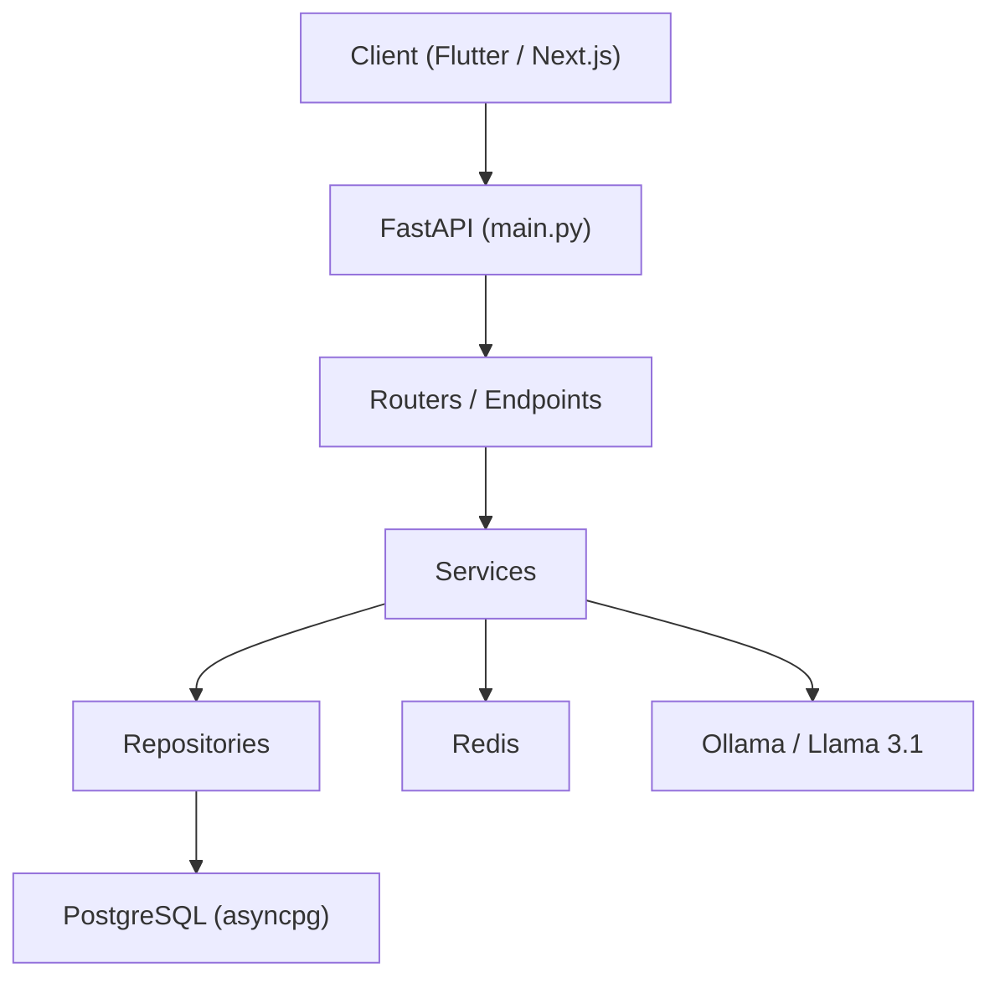
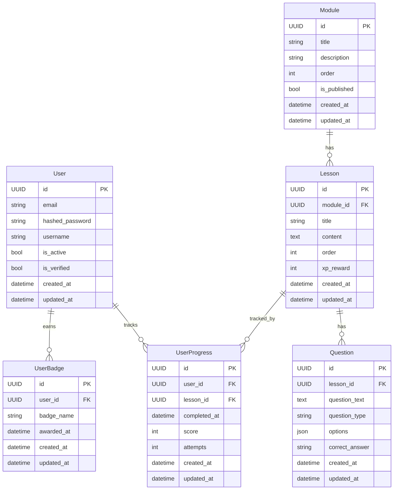

# Design Document: Coderun Monorepo Altyapısı

## Overview

Coderun, Python/DevOps/Cloud konularını Duolingo benzeri gamification mekanikleriyle öğreten bir eğitim platformudur. Bu tasarım belgesi, projenin monorepo altyapısını sıfırdan kurmak için gereken teknik kararları, bileşen mimarisini ve veri modellerini tanımlar.

Monorepo yaklaşımı tercih edilmesinin temel nedenleri:
- Backend, mobile, web ve infrastructure kodlarının tek bir versiyonlama döngüsünde yönetilmesi
- Paylaşılan CI/CD pipeline'larının kolayca tanımlanabilmesi
- Cross-cutting değişikliklerin (örn. API kontratı güncellemeleri) tek bir PR ile yapılabilmesi

Temel teknoloji seçimleri:
- **FastAPI**: Async-first, tip güvenli, otomatik OpenAPI dokümantasyonu
- **SQLAlchemy 2.x async**: `asyncpg` sürücüsü ile yüksek performanslı async veritabanı erişimi
- **Pydantic v2**: Veri doğrulama ve serializasyon
- **Docker Compose**: Yerel geliştirme ortamı orkestrasyonu
- **Terraform**: AWS altyapı yönetimi (IaC)

---

## Architecture

Sistem, aşağıdaki katmanlı mimariye dayanır:



### Katman Sorumlulukları

| Katman | Dizin | Sorumluluk |
|---|---|---|
| Endpoints / Routers | `backend/app/endpoints/` | HTTP istek/yanıt yönetimi, input doğrulama |
| Services | `backend/app/services/` | İş mantığı, orchestration |
| Repositories | `backend/app/repositories/` | Veritabanı CRUD soyutlaması |
| Models | `backend/app/models/` | SQLAlchemy ORM tanımları |
| Schemas | `backend/app/schemas/` | Pydantic giriş/çıkış şemaları |
| Core | `backend/app/core/` | Config, DB bağlantısı, güvenlik |

### Monorepo Dizin Yapısı

```
coderun/
├── .github/
│   └── workflows/
│       ├── backend-ci.yml
│       ├── mobile-ci.yml
│       └── web-ci.yml
├── backend/
│   ├── app/
│   │   ├── core/
│   │   │   ├── config.py
│   │   │   ├── database.py
│   │   │   └── security.py
│   │   ├── models/
│   │   │   ├── base.py
│   │   │   ├── user.py
│   │   │   ├── module.py
│   │   │   ├── lesson.py
│   │   │   ├── question.py
│   │   │   ├── user_progress.py
│   │   │   └── user_badge.py
│   │   ├── schemas/
│   │   │   ├── user.py
│   │   │   ├── auth.py
│   │   │   └── common.py
│   │   ├── repositories/
│   │   │   ├── base.py
│   │   │   ├── user.py
│   │   │   └── progress.py
│   │   ├── services/
│   │   │   └── (feature services)
│   │   ├── endpoints/
│   │   │   └── health.py
│   │   └── main.py
│   ├── alembic/
│   ├── Dockerfile
│   └── requirements.txt
├── mobile/
├── web/
├── infrastructure/
│   └── terraform/
├── docker-compose.yml
├── .env.example
├── .gitignore
└── README.md
```

### Dependency Injection Akışı

FastAPI'nin `Depends()` mekanizması kullanılır. Hiçbir global mutable state tutulmaz:

```
Request → Endpoint → Depends(get_db) → AsyncSession
                   → Depends(get_current_user) → UserRepository(session)
                   → Service(repository)
```

---

## Components and Interfaces

### Core: config.py

`pydantic-settings` tabanlı `Settings` sınıfı. Tüm değerler ortam değişkenlerinden okunur; magic number içermez.

```python
class Settings(BaseSettings):
    DATABASE_URL: str
    REDIS_URL: str
    SECRET_KEY: str
    ALGORITHM: str = "HS256"
    ACCESS_TOKEN_EXPIRE_MINUTES: int = 30
    ENVIRONMENT: str = "development"
    ALLOWED_ORIGINS: list[str] = ["http://localhost:3000"]

    @property
    def is_production(self) -> bool:
        return self.ENVIRONMENT == "production"

    model_config = SettingsConfigDict(env_file=".env")
```

### Core: database.py

`asyncpg` sürücüsü ile async SQLAlchemy engine. `get_db()` FastAPI dependency olarak kullanılır.

```python
async def get_db() -> AsyncGenerator[AsyncSession, None]:
    async with AsyncSessionLocal() as session:
        try:
            yield session
            await session.commit()
        except Exception:
            await session.rollback()
            raise
```

### Core: security.py

JWT token yönetimi ve bcrypt parola hashleme. Düz metin parola hiçbir zaman loglanmaz.

```python
def create_access_token(data: dict, expires_delta: timedelta | None = None) -> str: ...
def verify_token(token: str) -> TokenData | None: ...
def hash_password(password: str) -> str: ...
def verify_password(plain: str, hashed: str) -> bool: ...
```

### BaseRepository[T]

Generic abstract sınıf. Tüm entity repository'leri bu sınıftan türer.

```python
class BaseRepository(Generic[T], ABC):
    def __init__(self, session: AsyncSession, model: type[T]) -> None: ...
    async def get_by_id(self, id: UUID) -> T | None: ...
    async def get_all(self, skip: int = 0, limit: int = 100) -> list[T]: ...
    async def create(self, obj_in: dict) -> T: ...
    async def update(self, id: UUID, obj_in: dict) -> T | None: ...
    async def delete(self, id: UUID) -> bool: ...
```

### UserRepository

```python
class UserRepository(BaseRepository[User]):
    async def get_by_email(self, email: str) -> User | None: ...
```

### ProgressRepository

```python
class ProgressRepository(BaseRepository[UserProgress]):
    async def get_by_user_and_lesson(
        self, user_id: UUID, lesson_id: UUID
    ) -> UserProgress | None: ...
```

### Pydantic Schemas

| Dosya | Sınıflar |
|---|---|
| `schemas/user.py` | `UserCreate`, `UserUpdate`, `UserResponse` |
| `schemas/auth.py` | `LoginRequest`, `TokenResponse`, `TokenData` |
| `schemas/common.py` | `PaginatedResponse[T]` |

`UserResponse` içinde `hashed_password` alanı yer almaz. Tüm UUID alanları `uuid.UUID` tipindedir.

### FastAPI main.py

```python
app = FastAPI(
    title=settings.APP_TITLE,
    version=settings.APP_VERSION,
    docs_url=None if settings.is_production else "/docs",
    redoc_url=None if settings.is_production else "/redoc",
    openapi_url=None if settings.is_production else "/openapi.json",
)
app.add_middleware(CORSMiddleware, allow_origins=settings.ALLOWED_ORIGINS, ...)
app.include_router(health_router)
app.include_router(api_router, prefix="/api/v1")
```

### Docker Compose Servisleri

| Servis | İmaj | Port |
|---|---|---|
| backend | ./backend (Dockerfile) | 8000 |
| web | ./web (Dockerfile) | 3000 |
| db | postgres:15-alpine | 5432 |
| redis | redis:7-alpine | 6379 |
| ollama | ollama/ollama | 11434 |

`backend` servisi `db` ve `redis`'e `depends_on` ile bağımlıdır. Tüm hassas değerler `.env` dosyasından `${VARIABLE}` sözdizimi ile okunur.

---

## Data Models

### BaseModel (SQLAlchemy)

Tüm entity modelleri bu sınıftan türer.

```python
class Base(DeclarativeBase):
    pass

class BaseModel(Base):
    __abstract__ = True

    id: Mapped[UUID] = mapped_column(
        UUID(as_uuid=True), primary_key=True, default=uuid4
    )
    created_at: Mapped[datetime] = mapped_column(
        DateTime(timezone=True),
        server_default=func.now(),
        index=True,
    )
    updated_at: Mapped[datetime] = mapped_column(
        DateTime(timezone=True),
        server_default=func.now(),
        onupdate=func.now(),
        index=True,
    )
```

### Entity Modelleri



### Tasarım Kararları

1. **UUID as_uuid=True**: UUID'ler Python `uuid.UUID` nesnesi olarak saklanır, string değil. Bu, tip güvenliğini artırır ve yanlışlıkla string karşılaştırmasını önler.
2. **`hashed_password` alanı**: `User` modelinde `password` değil `hashed_password` alanı bulunur. Bu, düz metin parolanın yanlışlıkla saklanmasını önler.
3. **`options` JSON alanı**: `Question.options` için JSON tipi kullanılır; bu, farklı soru tiplerinin (çoktan seçmeli, doğru/yanlış) esnek biçimde temsil edilmesini sağlar.
4. **`index=True` on timestamps**: `created_at` ve `updated_at` alanlarına indeks eklenir; sıralama ve filtreleme sorgularını hızlandırır.
5. **`__abstract__ = True`**: `BaseModel` doğrudan tablo oluşturmaz; sadece kalıtım için kullanılır.


---

## Correctness Properties

*A property is a characteristic or behavior that should hold true across all valid executions of a system — essentially, a formal statement about what the system should do. Properties serve as the bridge between human-readable specifications and machine-verifiable correctness guarantees.*

### Property 1: Kod Kalitesi Kuralları Evrensel Uyumu

*For any* Python dosyası `backend/app/` altında, o dosya: (a) ilk satırında açıklayıcı bir yorum içermeli, (b) tüm fonksiyon ve metot imzalarında type hint bulunmalı, (c) tüm public fonksiyon ve metotlarda docstring bulunmalıdır.

**Validates: Requirements 2.5, 2.6, 2.7**

---

### Property 2: Parola Hashleme Round-Trip

*For any* geçerli parola string'i, `hash_password(password)` ile hashlendikten sonra `verify_password(password, hashed)` çağrısı `True` döndürmelidir; ve `verify_password(wrong_password, hashed)` çağrısı (farklı bir parola için) `False` döndürmelidir.

**Validates: Requirements 5.6**

---

### Property 3: Parola Loglama Yasağı

*For any* `security.py` fonksiyonu çağrısında (hash_password, verify_password, create_access_token, verify_token), log çıktısı düz metin parola string'i içermemelidir.

**Validates: Requirements 5.7**

---

### Property 4: Repository Hata Durumunda Rollback

*For any* repository işlemi sırasında bir veritabanı hatası oluştuğunda, session'ın `rollback()` metodu çağrılmalı ve uygun bir exception fırlatılmalıdır; veritabanı tutarlı durumda kalmalıdır.

**Validates: Requirements 4.6**

---

### Property 5: Docker Compose Hassas Değer Yasağı

*For any* `docker-compose.yml` içindeki servis tanımında, hassas değerler (parola, secret key, token) sabit kodlanmış string olarak bulunmamalı; tüm bu değerler `${VARIABLE_NAME}` sözdizimi ile ortam değişkeninden okunmalıdır.

**Validates: Requirements 7.5**

---

### Property 6: Bağımlılık Sürüm Sabitleme

*For any* `requirements.txt` satırında bir Python paketi tanımlandığında, o satır `==` operatörü ile sabitlenmiş bir sürüm numarası içermelidir; `>=`, `~=` veya sürümsüz tanım kabul edilmemelidir.

**Validates: Requirements 8.4**

---

### Property 7: UUID Tip Tutarlılığı

*For any* Pydantic şema sınıfında UUID semantiği taşıyan alan (id, user_id, lesson_id, module_id vb.), o alanın Python tipi `uuid.UUID` olmalıdır; `str` veya başka bir tip olmamalıdır.

**Validates: Requirements 6.4, 3.1**

---

## Error Handling

### Genel Strateji

Uygulama genelinde hata yönetimi üç katmanda ele alınır:

1. **Pydantic Doğrulama Hataları**: FastAPI otomatik olarak `RequestValidationError`'ı yakalar ve HTTP 422 döndürür. Ek bir handler gerekmez.

2. **Repository Katmanı Hataları**: SQLAlchemy exception'ları (`IntegrityError`, `NoResultFound` vb.) repository içinde yakalanır, rollback yapılır ve domain-specific exception'a dönüştürülür.

3. **Global Exception Handler**: `main.py`'de `@app.exception_handler` ile beklenmedik hatalar için HTTP 500 döndürülür; stack trace loglanır ancak client'a gönderilmez.

### Hata Kategorileri

| Hata Tipi | HTTP Kodu | Açıklama |
|---|---|---|
| Pydantic ValidationError | 422 | Geçersiz istek verisi |
| Kimlik doğrulama hatası | 401 | Geçersiz/süresi dolmuş token |
| Yetkilendirme hatası | 403 | Yetersiz izin |
| Kaynak bulunamadı | 404 | Entity mevcut değil |
| Çakışma | 409 | Unique constraint ihlali (örn. email) |
| Veritabanı hatası | 500 | Beklenmedik DB hatası |

### Güvenlik Kuralları

- Hata mesajları stack trace veya iç sistem detayı içermez (production'da)
- `ENVIRONMENT=development` modunda detaylı hata mesajları döndürülebilir
- Parola içeren alanlar hiçbir zaman loglanmaz (bkz. Property 3)
- JWT doğrulama hatalarında token içeriği loglanmaz

### Veritabanı Bağlantı Hatası

`main.py` startup event'inde DB bağlantısı test edilir:

```python
@app.on_event("startup")
async def startup_event():
    try:
        async with engine.connect() as conn:
            await conn.execute(text("SELECT 1"))
    except Exception as e:
        logger.critical(f"Database connection failed: {e}")
        raise SystemExit(1)
```

---

## Testing Strategy

### Genel Yaklaşım

İki tamamlayıcı test türü kullanılır:

- **Unit testler**: Belirli örnekler, edge case'ler ve hata koşulları için
- **Property-based testler**: Evrensel özelliklerin tüm girdiler üzerinde doğrulanması için

Her iki tür de gereklidir; unit testler somut hataları yakalar, property testler genel doğruluğu doğrular.

### Araçlar

| Araç | Amaç |
|---|---|
| `pytest` | Test runner |
| `pytest-asyncio` | Async test desteği |
| `hypothesis` | Property-based testing (Python) |
| `httpx` | FastAPI test client (async) |
| `pytest-mock` | Mock/stub desteği |
| `factory-boy` | Test fixture üretimi |

### Property-Based Test Yapılandırması

Her property testi için minimum 100 iterasyon çalıştırılır:

```python
from hypothesis import given, settings, strategies as st

@settings(max_examples=100)
@given(st.text(min_size=8))
def test_password_hash_round_trip(password: str):
    # Feature: coderun-monorepo-setup, Property 2: Parola Hashleme Round-Trip
    hashed = hash_password(password)
    assert verify_password(password, hashed) is True
```

Her property testi şu yorum formatını içermelidir:
`# Feature: coderun-monorepo-setup, Property {N}: {property_text}`

### Property Test Eşleştirmesi

Her correctness property için tek bir property-based test yazılır:

| Property | Test Dosyası | Hypothesis Strategy |
|---|---|---|
| P1: Kod kalitesi kuralları | `test_code_quality.py` | `st.sampled_from(python_files)` |
| P2: Parola round-trip | `test_security.py` | `st.text(min_size=1)` |
| P3: Parola loglama yasağı | `test_security.py` | `st.text(min_size=1)` |
| P4: Repository rollback | `test_repositories.py` | `st.builds(mock_db_error)` |
| P5: Docker Compose hassas değer | `test_docker_compose.py` | `st.sampled_from(sensitive_keys)` |
| P6: Bağımlılık sürüm sabitleme | `test_requirements.py` | `st.sampled_from(requirements_lines)` |
| P7: UUID tip tutarlılığı | `test_schemas.py` | `st.sampled_from(schema_classes)` |

### Unit Test Kapsamı

Unit testler şu alanlara odaklanır:

- **Yapısal testler**: Dizin yapısı, dosya varlığı, `__init__.py` kontrolü
- **Model testler**: Her modelin beklenen alanları içerdiği, `BaseModel`'den türediği
- **Schema testler**: `UserResponse`'un `hashed_password` içermediği, ORM uyumluluğu
- **Config testler**: `is_production` property'si, ortam değişkeni okuma
- **Endpoint testler**: `/health` yanıt formatı, production'da OpenAPI devre dışı
- **Docker Compose testler**: Servis tanımları, imaj versiyonları, volume yapılandırması

### Test Dizin Yapısı

```
backend/
└── tests/
    ├── conftest.py          # Shared fixtures, async session mock
    ├── test_code_quality.py # P1: Kod kalitesi property testi
    ├── test_security.py     # P2, P3: Parola property testleri
    ├── test_repositories.py # P4: Repository rollback property testi
    ├── test_schemas.py      # P7: UUID tip property testi
    ├── test_models.py       # Unit: Model alan kontrolleri
    ├── test_config.py       # Unit: Config doğrulama
    ├── test_health.py       # Unit: /health endpoint
    ├── test_requirements.py # P6: requirements.txt property testi
    └── test_docker_compose.py # P5, Unit: Docker Compose kontrolleri
```

### CI/CD Entegrasyonu

`.github/workflows/backend-ci.yml` içinde:

```yaml
- name: Run tests
  run: pytest backend/tests/ --asyncio-mode=auto -v
```

Property testleri CI'da da çalışır; `hypothesis` veritabanı (`hypothesis/` dizini) commit edilmez.
