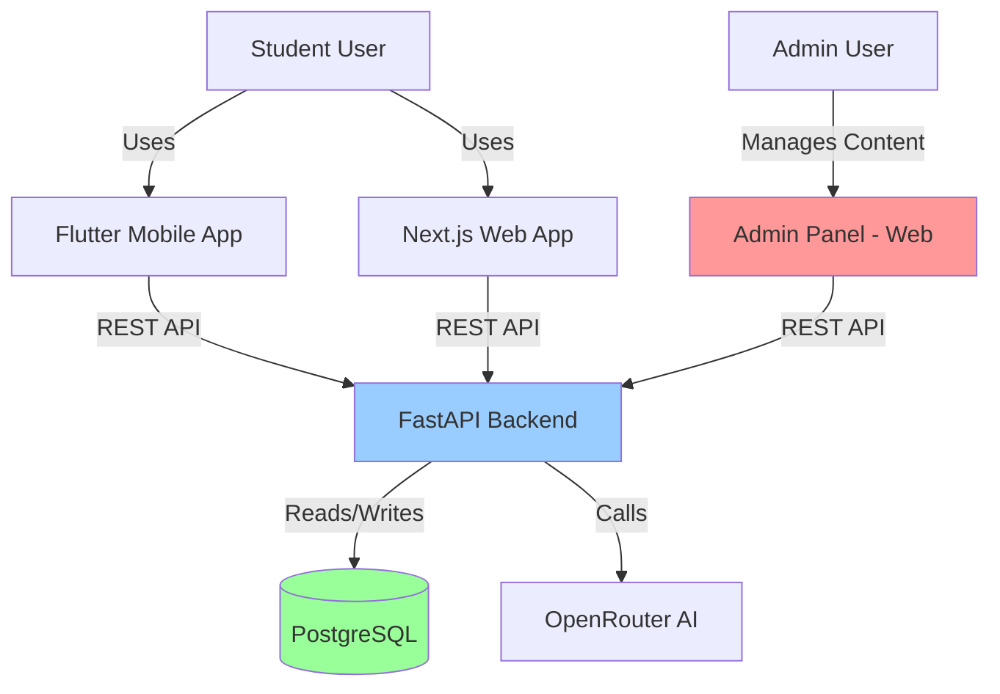
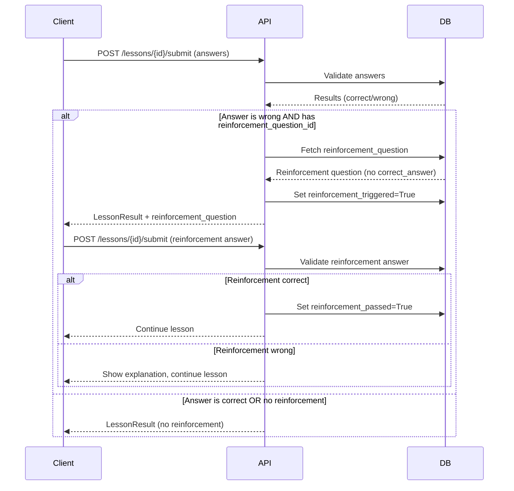

# Design Document: Interactive Education Admin

## Overview

This design document outlines the technical architecture for adding interactive question types, a reinforcement learning algorithm, and an admin panel to the Coderun platform. The implementation spans three platforms:

1. **Backend (FastAPI)**: Extended data models, new API endpoints, reinforcement logic
2. **Web (Next.js)**: Interactive question components, 3-column lesson layout, admin panel
3. **Mobile (Flutter)**: Interactive question widgets, reinforcement UI, Ghostie reactions

The feature enables content creators to build more engaging lessons with 6 new question types (`fill_in_blank`, `reorder`, `true_false_reason`, `spot_the_bug`, `multi_select`, plus existing `code_completion`), while students receive immediate reinforcement when they answer incorrectly.

### Key Design Principles

- **Separation of Concerns**: Question rendering logic is isolated in dedicated widgets/components per platform
- **Type Safety**: All new fields are strongly typed in backend schemas, TypeScript interfaces, and Dart models
- **Progressive Enhancement**: New question types fall back gracefully to `multiple_choice` if not recognized
- **Security First**: Admin endpoints protected by `is_superuser` guard; `correct_answer` never sent to client
- **Reinforcement Loop Prevention**: Self-referential FK constraint ensures reinforcement questions cannot have their own reinforcement questions placeholder


---

## Architecture

### System Context



### High-Level Architecture

The system follows a three-tier architecture:

1. **Presentation Layer**
   - **Mobile**: Flutter widgets for interactive questions, reinforcement cards, Ghostie reactions
   - **Web Student**: Next.js components for 3-column lesson layout with interactive questions
   - **Web Admin**: Next.js admin panel with CRUD interfaces for content management

2. **Application Layer**
   - **FastAPI Backend**: REST API endpoints for lessons, questions, admin operations
   - **Business Logic**: Reinforcement algorithm, XP/streak calculation, answer validation
   - **Authentication**: JWT-based auth with superuser role checking

3. **Data Layer**
   - **PostgreSQL**: Relational database with SQLAlchemy ORM
   - **Alembic**: Database migration management
   - **Models**: User, Module, Unit, Lesson, Question, UserProgress

### Data Flow: Reinforcement Algorithm



---

## Components and Interfaces

### Backend Components

#### 1. Database Models (SQLAlchemy ORM)

**Question Model Extensions** (`backend/app/models/question.py`)

```python
class Question(BaseModel):
    # Existing fields
    lesson_id: Mapped[UUID]
    question_type: Mapped[str]  # Extended enum
    question_text: Mapped[str]
    options: Mapped[dict | None]
    correct_answer: Mapped[str]
    hint: Mapped[str | None]
    order: Mapped[int]
    
    # NEW FIELDS
    explanation: Mapped[str | None]  # Shown after wrong answer
    code_block: Mapped[str | None]  # For spot_the_bug, code_completion
    word_bank: Mapped[dict | None]  # For fill_in_blank {"words": ["def", "return"]}
    buggy_line_index: Mapped[int | None]  # For spot_the_bug (0-indexed)
    is_reinforcement: Mapped[bool] = False  # Marks reinforcement questions
    reinforcement_question_id: Mapped[UUID | None]  # Self-referential FK
    
    # Relationships
    reinforcement_question: Mapped["Question | None"] = relationship(
        "Question",
        remote_side="Question.id",
        foreign_keys=[reinforcement_question_id],
        lazy="joined"
    )
```

**User Model Extensions** (`backend/app/models/user.py`)

```python
class User(BaseModel):
    # Existing fields...
    
    # NEW FIELD
    is_superuser: Mapped[bool] = mapped_column(Boolean, default=False)
```

**UserProgress Model Extensions** (`backend/app/models/user_progress.py`)

```python
class UserProgress(BaseModel):
    # Existing fields...
    
    # NEW FIELDS
    reinforcement_triggered: Mapped[bool] = False
    reinforcement_passed: Mapped[bool] = False
```

#### 2. API Schemas (Pydantic)

**QuestionResponse** (`backend/app/schemas/question.py`)

```python
class QuestionResponse(BaseModel):
    id: UUID
    lesson_id: UUID
    question_type: str
    question_text: str
    options: dict | None = None
    hint: str | None = None
    
    # NEW FIELDS
    explanation: str | None = None
    code_block: str | None = None
    word_bank: dict | None = None  # {"words": ["def", "return", "print"]}
    buggy_line_index: int | None = None
    is_reinforcement: bool = False
    order: int
    
    # Nested reinforcement question (recursive)
    reinforcement_question: "QuestionResponse | None" = None
    
    # NEVER include correct_answer in client response
```

**LessonResultResponse** (`backend/app/schemas/lesson.py`)

```python
class LessonResultResponse(BaseModel):
    lesson_id: UUID
    score: float
    correct_count: int
    wrong_count: int
    xp_earned: int
    is_completed: bool
    message: str
    level_up: bool
    new_level: int
    new_streak: int
    badges_earned: list[BadgeResponse]
    
    # NEW FIELD
    reinforcement_question: QuestionResponse | None = None
```

#### 3. Admin Service Layer

**Admin Service** (`backend/app/services/admin_service.py`)

```python
async def get_admin_stats(db: AsyncSession) -> AdminStatsResponse:
    """Returns dashboard statistics: total users, active users, completed lessons."""
    
async def get_paths(db: AsyncSession) -> list[PathListItem]:
    """Lists all learning paths (modules)."""
    
async def create_path(db: AsyncSession, data: dict) -> Module:
    """Creates new learning path."""
    
async def update_path(db: AsyncSession, path_id: UUID, data: dict) -> Module | None:
    """Updates learning path."""
    
async def delete_path(db: AsyncSession, path_id: UUID) -> bool:
    """Deletes learning path."""
    
async def reorder_paths(db: AsyncSession, items: list[dict]) -> None:
    """Reorders learning paths."""
    
# Similar CRUD methods for units, lessons, questions, users
```

#### 4. Lesson Service Extensions

**Reinforcement Logic** (`backend/app/services/lesson_service.py`)

```python
async def submit_lesson(
    db: AsyncSession,
    user_id: UUID,
    lesson_id: UUID,
    answers: list[AnswerSubmit]
) -> LessonResultResponse:
    """
    Validates answers, calculates score, awards XP.
    
    Reinforcement Algorithm:
    1. For each wrong answer, check if question.reinforcement_question_id exists
    2. If yes, fetch reinforcement question (without correct_answer)
    3. Set user_progress.reinforcement_triggered = True
    4. Return reinforcement_question in response
    5. On next submit, validate reinforcement answer:
       - If correct: set reinforcement_passed = True, continue
       - If wrong: show explanation, continue (no second reinforcement)
    """
    
    # Validate answers
    results = await _validate_answers(db, lesson_id, answers)
    
    # Check for reinforcement trigger
    reinforcement_question = None
    for result in results:
        if not result.is_correct and result.question.reinforcement_question_id:
            reinforcement_question = await _fetch_reinforcement_question(
                db, result.question.reinforcement_question_id
            )
            await _mark_reinforcement_triggered(db, user_id, lesson_id)
            break  # Only one reinforcement per submission
    
    # Calculate XP, update progress
    xp_earned = await _calculate_xp(db, user_id, lesson_id, results)
    
    return LessonResultResponse(
        ...,
        reinforcement_question=reinforcement_question
    )
```

### Web Components (Next.js)

#### 1. Interactive Question Components

**Component Structure** (`web/coderun-web/src/components/lesson/`)

```
lesson/
├── questions/
│   ├── MultipleChoiceQuestion.tsx (existing)
│   ├── CodeCompletionQuestion.tsx (existing)
│   ├── FillInBlankQuestion.tsx (NEW)
│   ├── ReorderQuestion.tsx (NEW)
│   ├── TrueFalseReasonQuestion.tsx (NEW)
│   ├── SpotTheBugQuestion.tsx (NEW)
│   ├── MultiSelectQuestion.tsx (NEW)
│   └── QuestionRouter.tsx (routes to correct component)
├── ReinforcementQuestion.tsx (NEW)
└── LessonLayout.tsx (3-column layout)
```

**FillInBlankQuestion Component**

```typescript
interface FillInBlankQuestionProps {
  question: QuestionResponse;
  onAnswer: (answer: string) => void;
}

export function FillInBlankQuestion({ question, onAnswer }: FillInBlankQuestionProps) {
  const [selectedWords, setSelectedWords] = useState<string[]>([]);
  const wordBank = question.wordBank?.words || [];
  
  // Render code block with blank slots
  // Render word bank as draggable chips
  // On word selection, fill next blank
  // On submit, join selected words and call onAnswer
}
```

**ReorderQuestion Component**

```typescript
interface ReorderQuestionProps {
  question: QuestionResponse;
  onAnswer: (answer: string) => void;
}

export function ReorderQuestion({ question, onAnswer }: ReorderQuestionProps) {
  const [lines, setLines] = useState<string[]>(question.options?.lines || []);
  
  // Use react-beautiful-dnd or @dnd-kit for drag-and-drop
  // Render code lines as draggable items
  // On reorder, update lines state
  // On submit, join lines with newline and call onAnswer
}
```

**SpotTheBugQuestion Component**

```typescript
interface SpotTheBugQuestionProps {
  question: QuestionResponse;
  onAnswer: (answer: string) => void;
}

export function SpotTheBugQuestion({ question, onAnswer }: SpotTheBugQuestionProps) {
  const [selectedLine, setSelectedLine] = useState<number | null>(null);
  const codeLines = question.codeBlock?.split('\n') || [];
  
  // Render code lines as clickable buttons
  // Highlight selected line
  // On submit, call onAnswer with line index as string
}
```

**ReinforcementQuestion Component**

```typescript
interface ReinforcementQuestionProps {
  question: QuestionResponse;
  onAnswer: (answer: string) => void;
}

export function ReinforcementQuestion({ question, onAnswer }: ReinforcementQuestionProps) {
  // Render in right panel (Ghostie Mentor style)
  // Show Ghostie mascot with encouraging message
  // Render question using QuestionRouter
  // Simplified UI, focus on concept reinforcement
}
```

#### 2. Lesson Layout (3-Column)

**LessonLayout Component** (`web/coderun-web/src/components/lesson/LessonLayout.tsx`)

```typescript
export function LessonLayout({ lesson, currentQuestion }: LessonLayoutProps) {
  return (
    <div className="grid grid-cols-12 gap-4 h-screen">
      {/* Left Column: Progress & Navigation */}
      <aside className="col-span-2 bg-gray-50 p-4">
        <QuestionProgress current={currentIndex} total={totalQuestions} />
        <LessonNavigation />
      </aside>
      
      {/* Center Column: Question Content */}
      <main className="col-span-7 p-6">
        <QuestionRouter question={currentQuestion} onAnswer={handleAnswer} />
        <ActionButtons onNext={handleNext} onSubmit={handleSubmit} />
      </main>
      
      {/* Right Column: Ghostie Mentor / Reinforcement */}
      <aside className="col-span-3 bg-purple-50 p-4">
        {reinforcementQuestion ? (
          <ReinforcementQuestion question={reinforcementQuestion} onAnswer={handleReinforcement} />
        ) : (
          <GhostieMentor hint={currentQuestion.hint} />
        )}
      </aside>
    </div>
  );
}
```

#### 3. Admin Panel Components

**Admin Layout** (`web/coderun-web/src/app/admin/layout.tsx`)

```typescript
export default function AdminLayout({ children }: { children: React.ReactNode }) {
  return (
    <div className="flex h-screen">
      {/* Left Sidebar */}
      <aside className="w-64 bg-gray-900 text-white">
        <AdminNavigation />
      </aside>
      
      {/* Main Content */}
      <main className="flex-1 overflow-auto">
        <AdminHeader />
        <div className="p-6">{children}</div>
      </main>
    </div>
  );
}
```

**Question Editor** (`web/coderun-web/src/components/admin/QuestionEditor.tsx`)

```typescript
export function QuestionEditor({ lessonId, questionId }: QuestionEditorProps) {
  const [questionType, setQuestionType] = useState<QuestionType>('multiple_choice');
  const [formData, setFormData] = useState<QuestionFormData>({});
  
  // Render form fields based on questionType
  // - multiple_choice: options array
  // - fill_in_blank: word_bank, code_block
  // - reorder: options.lines array
  // - spot_the_bug: code_block, buggy_line_index
  // - multi_select: options array, correct_answer as comma-separated
  
  // Reinforcement toggle
  // - If enabled, show dropdown to select reinforcement question
  // - Validate: reinforcement question cannot itself have reinforcement
  
  return (
    <form onSubmit={handleSubmit}>
      <QuestionTypeSelect value={questionType} onChange={setQuestionType} />
      {renderFieldsForType(questionType)}
      <ReinforcementToggle />
      <SubmitButton />
    </form>
  );
}
```

### Mobile Components (Flutter)

#### 1. Interactive Question Widgets

**Widget Structure** (`mobile/coderun_mobile/lib/presentation/screens/lesson/widgets/`)

```
widgets/
├── multiple_choice_widget.dart (existing)
├── code_completion_widget.dart (existing)
├── mini_project_widget.dart (existing)
├── fill_in_blank_widget.dart (NEW)
├── reorder_widget.dart (NEW)
├── true_false_reason_widget.dart (NEW)
├── spot_the_bug_widget.dart (NEW)
├── multi_select_widget.dart (NEW)
├── reinforcement_card_widget.dart (NEW)
└── ghostie_reaction.dart (NEW)
```

**FillInBlankWidget**

```dart
class FillInBlankWidget extends StatefulWidget {
  final QuestionModel question;
  final String? currentAnswer;
  final ValueChanged<String> onAnswerChanged;
  
  @override
  Widget build(BuildContext context) {
    // Render code block with blank slots
    // Render word bank as chips
    // On chip tap, fill next blank
    // On answer complete, call onAnswerChanged
  }
}
```

**ReorderWidget**

```dart
class ReorderWidget extends StatefulWidget {
  final QuestionModel question;
  final String? currentAnswer;
  final ValueChanged<String> onAnswerChanged;
  
  @override
  Widget build(BuildContext context) {
    // Use ReorderableListView for drag-and-drop
    // Render code lines as draggable items
    // On reorder, update state and call onAnswerChanged
  }
}
```

**SpotTheBugWidget**

```dart
class SpotTheBugWidget extends StatefulWidget {
  final QuestionModel question;
  final String? currentAnswer;
  final ValueChanged<String> onAnswerChanged;
  
  @override
  Widget build(BuildContext context) {
    // Split code_block into lines
    // Render each line as tappable container
    // Highlight selected line
    // On tap, call onAnswerChanged with line index
  }
}
```

**ReinforcementCardWidget**

```dart
class ReinforcementCardWidget extends StatelessWidget {
  final QuestionModel reinforcementQuestion;
  final ValueChanged<String> onAnswer;
  
  @override
  Widget build(BuildContext context) {
    // Show Ghostie mascot with encouraging message
    // Render question using widget router
    // Simplified card UI with purple accent
  }
}
```

**GhostieReaction Widget**

```dart
class GhostieReaction extends StatelessWidget {
  final bool isCorrect;
  final bool isReinforcement;
  final String? message;
  
  @override
  Widget build(BuildContext context) {
    // Show different Ghostie expressions:
    // - Correct: Happy Ghostie + "Harika!" 
    // - Wrong: Sad Ghostie + "Bir daha dene"
    // - Reinforcement: Encouraging Ghostie + "Pekiştirelim"
  }
}
```

#### 2. LessonScreen Extensions

**Updated LessonScreen** (`mobile/coderun_mobile/lib/presentation/screens/lesson/lesson_screen.dart`)

```dart
Widget _buildQuestionWidget(
  String type,
  QuestionModel question,
  String? currentAnswer,
  LessonNotifier notifier,
) {
  switch (type) {
    case 'multiple_choice':
      return MultipleChoiceWidget(...);
    case 'code_completion':
      return CodeCompletionWidget(...);
    case 'fill_in_blank':
      return FillInBlankWidget(...);  // NEW
    case 'reorder':
      return ReorderWidget(...);  // NEW
    case 'true_false_reason':
      return TrueFalseReasonWidget(...);  // NEW
    case 'spot_the_bug':
      return SpotTheBugWidget(...);  // NEW
    case 'multi_select':
      return MultiSelectWidget(...);  // NEW
    case 'code_editor':
    case 'mini_project':
      return MiniProjectWidget(...);
    default:
      return MultipleChoiceWidget(...);  // Fallback
  }
}

// Handle reinforcement question in lesson flow
if (lessonState.reinforcementQuestion != null) {
  return ReinforcementCardWidget(
    reinforcementQuestion: lessonState.reinforcementQuestion!,
    onAnswer: (answer) => notifier.submitReinforcement(answer),
  );
}
```

---

## Data Models

### Database Schema Changes

#### Question Table Extensions

```sql
ALTER TABLE questions
ADD COLUMN explanation TEXT,
ADD COLUMN code_block TEXT,
ADD COLUMN word_bank JSONB,
ADD COLUMN buggy_line_index INTEGER,
ADD COLUMN is_reinforcement BOOLEAN DEFAULT FALSE,
ADD COLUMN reinforcement_question_id UUID REFERENCES questions(id);

-- Constraint: reinforcement questions cannot have reinforcement
ALTER TABLE questions
ADD CONSTRAINT chk_no_nested_reinforcement
CHECK (
  (is_reinforcement = FALSE) OR 
  (is_reinforcement = TRUE AND reinforcement_question_id IS NULL)
);

-- Index for reinforcement lookups
CREATE INDEX idx_questions_reinforcement ON questions(reinforcement_question_id);
```

#### User Table Extensions

```sql
ALTER TABLE users
ADD COLUMN is_superuser BOOLEAN DEFAULT FALSE;

-- Index for admin queries
CREATE INDEX idx_users_superuser ON users(is_superuser) WHERE is_superuser = TRUE;
```

#### UserProgress Table Extensions

```sql
ALTER TABLE user_progress
ADD COLUMN reinforcement_triggered BOOLEAN DEFAULT FALSE,
ADD COLUMN reinforcement_passed BOOLEAN DEFAULT FALSE;
```

### Type Definitions

#### TypeScript Types (`web/coderun-web/src/lib/types/module.types.ts`)

```typescript
export type QuestionType =
  | 'multiple_choice'
  | 'code_completion'
  | 'code_editor'
  | 'fill_in_blank'
  | 'reorder'
  | 'true_false_reason'
  | 'spot_the_bug'
  | 'multi_select';

export interface QuestionResponse {
  id: string;
  lessonId: string;
  questionType: QuestionType;
  questionText: string;
  options: Record<string, unknown> | null;
  hint: string | null;
  
  // NEW FIELDS
  explanation: string | null;
  codeBlock: string | null;
  wordBank: { words: string[] } | null;
  buggyLineIndex: number | null;
  isReinforcement: boolean;
  order: number;
  
  reinforcementQuestion: QuestionResponse | null;
}

export interface LessonResultResponse {
  lessonId: string;
  score: number;
  correctCount: number;
  wrongCount: number;
  xpEarned: number;
  isCompleted: boolean;
  message: string;
  levelUp: boolean;
  newLevel: number;
  newStreak: number;
  badgesEarned: BadgeResponse[];
  
  // NEW FIELD
  reinforcementQuestion: QuestionResponse | null;
}
```

#### Dart Models (`mobile/coderun_mobile/lib/data/models/`)

```dart
@JsonSerializable()
class QuestionModel {
  final String id;
  @JsonKey(name: 'lesson_id')
  final String lessonId;
  @JsonKey(name: 'question_type')
  final String questionType;
  @JsonKey(name: 'question_text')
  final String questionText;
  final Map<String, dynamic>? options;
  final String? hint;
  
  // NEW FIELDS
  final String? explanation;
  @JsonKey(name: 'code_block')
  final String? codeBlock;
  @JsonKey(name: 'word_bank')
  final Map<String, dynamic>? wordBank;
  @JsonKey(name: 'buggy_line_index')
  final int? buggyLineIndex;
  @JsonKey(name: 'is_reinforcement')
  final bool isReinforcement;
  final int order;
  
  @JsonKey(name: 'reinforcement_question')
  final QuestionModel? reinforcementQuestion;
}

@JsonSerializable()
class LessonResultModel {
  @JsonKey(name: 'lesson_id')
  final String lessonId;
  final double score;
  @JsonKey(name: 'correct_count')
  final int correctCount;
  @JsonKey(name: 'wrong_count')
  final int wrongCount;
  @JsonKey(name: 'xp_earned')
  final int xpEarned;
  @JsonKey(name: 'is_completed')
  final bool isCompleted;
  final String message;
  @JsonKey(name: 'level_up')
  final bool levelUp;
  @JsonKey(name: 'new_level')
  final int newLevel;
  @JsonKey(name: 'new_streak')
  final int newStreak;
  @JsonKey(name: 'badges_earned')
  final List<BadgeModel> badgesEarned;
  
  // NEW FIELD
  @JsonKey(name: 'reinforcement_question')
  final QuestionModel? reinforcementQuestion;
}
```

---

## Error Handling

### Backend Error Scenarios

1. **Invalid Question Type**
   - **Scenario**: Client submits answer for unknown question_type
   - **Handling**: Return 400 Bad Request with message "Invalid question type"
   - **Prevention**: Validate question_type against QUESTION_TYPES enum

2. **Missing Required Fields**
   - **Scenario**: `fill_in_blank` question without `word_bank`
   - **Handling**: Pydantic validation raises 422 Unprocessable Entity
   - **Prevention**: Schema validation with conditional required fields

3. **Reinforcement Loop**
   - **Scenario**: Admin tries to set reinforcement_question_id on a reinforcement question
   - **Handling**: Database constraint violation, return 400 with message
   - **Prevention**: Check constraint `chk_no_nested_reinforcement`

4. **Unauthorized Admin Access**
   - **Scenario**: Non-superuser tries to access `/admin` endpoints
   - **Handling**: `get_current_superuser` dependency raises 403 Forbidden
   - **Prevention**: Middleware checks `is_superuser` flag

5. **Reinforcement Question Not Found**
   - **Scenario**: Question references non-existent reinforcement_question_id
   - **Handling**: Foreign key constraint violation, return 404
   - **Prevention**: Validate reinforcement_question_id exists before saving

### Frontend Error Scenarios

1. **Unknown Question Type**
   - **Scenario**: Backend returns new question_type not yet implemented
   - **Handling**: Fall back to `MultipleChoiceWidget` / `MultipleChoiceQuestion`
   - **Prevention**: Default case in switch statement

2. **Network Failure During Submission**
   - **Scenario**: API call fails mid-lesson
   - **Handling**: Show error toast, allow retry, preserve answers in local state
   - **Prevention**: Implement retry logic with exponential backoff

3. **Malformed Question Data**
   - **Scenario**: `word_bank` is null for `fill_in_blank` question
   - **Handling**: Show error message "Question data incomplete", skip question
   - **Prevention**: Backend validation ensures data integrity

4. **Admin Panel Unauthorized**
   - **Scenario**: User navigates to `/admin` without `is_superuser`
   - **Handling**: Middleware redirects to `/login` with error message
   - **Prevention**: Check `is_superuser` in middleware, hide admin nav for non-superusers

### Error Response Format

```typescript
interface ErrorResponse {
  detail: string;
  code?: string;
  field?: string;
}

// Example: 400 Bad Request
{
  "detail": "word_bank is required for fill_in_blank questions",
  "code": "MISSING_REQUIRED_FIELD",
  "field": "word_bank"
}

// Example: 403 Forbidden
{
  "detail": "Superuser access required",
  "code": "INSUFFICIENT_PERMISSIONS"
}
```

---

## Testing Strategy

### Backend Testing

#### Unit Tests

**Question Model Tests** (`backend/tests/test_models/test_question.py`)

```python
def test_question_with_reinforcement():
    """Test question with reinforcement_question_id."""
    
def test_reinforcement_question_cannot_have_reinforcement():
    """Test constraint: is_reinforcement=True cannot have reinforcement_question_id."""
    
def test_fill_in_blank_validation():
    """Test fill_in_blank requires word_bank."""
    
def test_spot_the_bug_validation():
    """Test spot_the_bug requires code_block and buggy_line_index."""
```

**Reinforcement Algorithm Tests** (`backend/tests/test_services/test_lesson_service.py`)

```python
async def test_wrong_answer_triggers_reinforcement():
    """Test that wrong answer with reinforcement_question_id returns reinforcement."""
    
async def test_correct_reinforcement_continues_lesson():
    """Test that correct reinforcement answer sets reinforcement_passed=True."""
    
async def test_wrong_reinforcement_shows_explanation():
    """Test that wrong reinforcement answer shows explanation, no second reinforcement."""
    
async def test_no_reinforcement_for_correct_answer():
    """Test that correct answer does not trigger reinforcement."""
```

**Admin Endpoint Tests** (`backend/tests/test_api/test_admin.py`)

```python
async def test_admin_stats_requires_superuser():
    """Test that non-superuser gets 403 on /admin/stats."""
    
async def test_create_question_with_reinforcement():
    """Test creating question with reinforcement_question_id."""
    
async def test_update_question_type_validates_fields():
    """Test that changing question_type validates required fields."""
```

#### Integration Tests

```python
async def test_full_lesson_flow_with_reinforcement():
    """
    End-to-end test:
    1. Submit lesson with wrong answer
    2. Receive reinforcement question
    3. Submit reinforcement answer (correct)
    4. Verify reinforcement_passed=True
    5. Complete lesson
    """
```

### Frontend Testing (Web)

#### Component Tests (Jest + React Testing Library)

```typescript
describe('FillInBlankQuestion', () => {
  it('renders word bank and blank slots', () => {});
  it('fills blank on word selection', () => {});
  it('calls onAnswer with joined words', () => {});
});

describe('ReorderQuestion', () => {
  it('renders draggable code lines', () => {});
  it('reorders lines on drag', () => {});
  it('calls onAnswer with reordered lines', () => {});
});

describe('ReinforcementQuestion', () => {
  it('renders in right panel with Ghostie', () => {});
  it('routes to correct question component', () => {});
});

describe('QuestionEditor', () => {
  it('shows word_bank field for fill_in_blank', () => {});
  it('shows code_block field for spot_the_bug', () => {});
  it('validates reinforcement question selection', () => {});
});
```

#### E2E Tests (Playwright)

```typescript
test('complete lesson with reinforcement', async ({ page }) => {
  // 1. Navigate to lesson
  // 2. Answer question incorrectly
  // 3. Verify reinforcement question appears
  // 4. Answer reinforcement correctly
  // 5. Verify lesson continues
});

test('admin creates fill_in_blank question', async ({ page }) => {
  // 1. Login as superuser
  // 2. Navigate to question editor
  // 3. Select fill_in_blank type
  // 4. Fill word_bank and code_block
  // 5. Save question
  // 6. Verify question appears in lesson
});
```

### Mobile Testing (Flutter)

#### Widget Tests

```dart
testWidgets('FillInBlankWidget renders word bank', (tester) async {
  // Arrange
  final question = QuestionModel(...);
  
  // Act
  await tester.pumpWidget(FillInBlankWidget(question: question));
  
  // Assert
  expect(find.text('def'), findsOneWidget);
  expect(find.text('return'), findsOneWidget);
});

testWidgets('ReorderWidget reorders lines on drag', (tester) async {
  // Test drag-and-drop functionality
});

testWidgets('ReinforcementCardWidget shows Ghostie', (tester) async {
  // Test reinforcement UI
});
```

#### Integration Tests

```dart
testWidgets('lesson flow with reinforcement', (tester) async {
  // 1. Load lesson
  // 2. Answer question incorrectly
  // 3. Verify reinforcement card appears
  // 4. Answer reinforcement correctly
  // 5. Verify lesson continues
});
```

### Test Coverage Goals

- **Backend**: 80% line coverage, 100% coverage for reinforcement algorithm
- **Web**: 70% component coverage, 100% coverage for admin CRUD operations
- **Mobile**: 70% widget coverage, 100% coverage for question routing logic

---


## Implementation Approach

### Phase 1: Backend Foundation (Priority: High)

**Goal**: Extend database models, create migrations, update API schemas

**Tasks**:
1. Update `Question` model with new fields (`word_bank`, `code_block`, `buggy_line_index`, `explanation`, `is_reinforcement`, `reinforcement_question_id`)
2. Update `User` model with `is_superuser` field
3. Update `UserProgress` model with reinforcement tracking fields
4. Create Alembic migration for all schema changes
5. Update `QuestionResponse` schema (exclude `correct_answer`)
6. Update `LessonResultResponse` schema (add `reinforcement_question`)
7. Add validation logic for question type-specific required fields
8. Implement database constraint for reinforcement loop prevention

**Validation**:
- Run `alembic upgrade head` successfully
- Run `python -m compileall .` without errors
- Existing tests pass

### Phase 2: Reinforcement Algorithm (Priority: High)

**Goal**: Implement reinforcement logic in lesson submission flow

**Tasks**:
1. Extend `lesson_service.submit_lesson()` to detect wrong answers
2. Check for `reinforcement_question_id` on wrong answers
3. Fetch reinforcement question (without `correct_answer`)
4. Update `UserProgress` with `reinforcement_triggered=True`
5. Return reinforcement question in `LessonResultResponse`
6. Handle reinforcement answer submission:
   - If correct: set `reinforcement_passed=True`, continue
   - If wrong: show `explanation`, continue (no second reinforcement)
7. Add unit tests for all reinforcement scenarios

**Validation**:
- Test wrong answer triggers reinforcement
- Test correct reinforcement continues lesson
- Test wrong reinforcement shows explanation
- Test no double reinforcement

### Phase 3: Admin Backend Endpoints (Priority: High)

**Goal**: Create admin API endpoints with superuser protection

**Tasks**:
1. Implement `get_current_superuser` dependency in `app/api/v1/dependencies.py`
2. Create admin service layer (`app/services/admin_service.py`)
3. Implement admin endpoints in `app/api/v1/endpoints/admin.py`:
   - Dashboard stats
   - Paths CRUD
   - Units CRUD
   - Lessons CRUD
   - Questions CRUD (with `correct_answer` for admin)
   - Users read-only
4. Add admin router to `app/api/v1/router.py`
5. Add unit tests for admin endpoints (403 for non-superusers)

**Validation**:
- Non-superuser gets 403 on admin endpoints
- Superuser can perform CRUD operations
- Question editor can set reinforcement_question_id

### Phase 4: Seed Data (Priority: Medium)

**Goal**: Add example questions for all new question types

**Tasks**:
1. Create seed data file or extend existing seed script
2. Add 2+ examples for each question type:
   - `fill_in_blank` with `word_bank`
   - `reorder` with `options.lines`
   - `true_false_reason` with true/false options
   - `spot_the_bug` with `code_block` and `buggy_line_index`
   - `multi_select` with multiple correct answers
3. Add 1+ reinforcement question example
4. Link reinforcement question to a main question

**Validation**:
- Seed script runs without errors
- All question types visible in database
- Reinforcement relationship correctly set

### Phase 5: Web Interactive Components (Priority: High)

**Goal**: Build interactive question components for web lesson page

**Tasks**:
1. Create `FillInBlankQuestion.tsx` component
   - Render code block with blank slots
   - Render word bank as chips
   - Handle word selection and blank filling
2. Create `ReorderQuestion.tsx` component
   - Integrate drag-and-drop library (@dnd-kit or react-beautiful-dnd)
   - Render code lines as draggable items
   - Handle reorder and submit
3. Create `TrueFalseReasonQuestion.tsx` component
   - Render true/false buttons
   - Render reason input field
4. Create `SpotTheBugQuestion.tsx` component
   - Render code lines as clickable buttons
   - Highlight selected line
5. Create `MultiSelectQuestion.tsx` component
   - Render checkboxes for options
   - Allow multiple selections
6. Create `QuestionRouter.tsx` to route to correct component
7. Update `LessonLayout.tsx` to use `QuestionRouter`
8. Add component tests for each question type

**Validation**:
- Each question type renders correctly
- User interactions work as expected
- Answer submission calls API correctly

### Phase 6: Web Reinforcement UI (Priority: High)

**Goal**: Display reinforcement questions in right panel

**Tasks**:
1. Create `ReinforcementQuestion.tsx` component
   - Render in right panel (Ghostie Mentor style)
   - Show Ghostie mascot with encouraging message
   - Use `QuestionRouter` for question rendering
2. Update `LessonLayout.tsx` to show reinforcement in right panel
3. Handle reinforcement answer submission
4. Show explanation on wrong reinforcement answer
5. Add component tests

**Validation**:
- Reinforcement appears after wrong answer
- Correct reinforcement continues lesson
- Wrong reinforcement shows explanation

### Phase 7: Web Admin Panel (Priority: Medium)

**Goal**: Build admin panel for content management

**Tasks**:
1. Create admin layout (`app/admin/layout.tsx`)
   - Left sidebar navigation
   - Top header with user info
2. Create admin pages:
   - Dashboard (`app/admin/page.tsx`) - stats display
   - Paths list (`app/admin/paths/page.tsx`)
   - Lessons list (`app/admin/lessons/page.tsx`)
   - Question editor (`app/admin/questions/[id]/page.tsx`)
   - Users list (`app/admin/users/page.tsx`)
3. Create `QuestionEditor.tsx` component
   - Question type selector
   - Dynamic form fields based on type
   - Reinforcement toggle and selector
   - Validation for required fields
4. Create admin API client (`lib/api/admin-api.ts`)
5. Add middleware for superuser check
6. Add E2E tests for admin workflows

**Validation**:
- Non-superuser redirected from /admin
- Superuser can create/edit/delete content
- Question editor validates required fields
- Reinforcement question selector works

### Phase 8: Mobile Interactive Widgets (Priority: High)

**Goal**: Build interactive question widgets for Flutter app

**Tasks**:
1. Update `QuestionModel` with new fields
2. Update `LessonResultModel` with `reinforcement_question`
3. Create `FillInBlankWidget`
   - Render code block with blank slots
   - Render word bank as chips
   - Handle tap to fill blank
4. Create `ReorderWidget`
   - Use `ReorderableListView`
   - Render code lines as draggable items
5. Create `TrueFalseReasonWidget`
   - Render true/false buttons
   - Render reason text field
6. Create `SpotTheBugWidget`
   - Render code lines as tappable containers
   - Highlight selected line
7. Create `MultiSelectWidget`
   - Render checkboxes for options
8. Update `LessonScreen._buildQuestionWidget()` to route to correct widget
9. Add widget tests for each type

**Validation**:
- Each widget renders correctly
- User interactions work as expected
- Answer submission works

### Phase 9: Mobile Reinforcement UI (Priority: High)

**Goal**: Display reinforcement questions with Ghostie reactions

**Tasks**:
1. Create `ReinforcementCardWidget`
   - Show Ghostie mascot
   - Render question using widget router
   - Purple accent styling
2. Create `GhostieReaction` widget
   - Different expressions for correct/wrong/reinforcement
   - Animated transitions
3. Update `LessonScreen` to show reinforcement card
4. Handle reinforcement answer submission
5. Add widget tests

**Validation**:
- Reinforcement card appears after wrong answer
- Ghostie reactions display correctly
- Correct reinforcement continues lesson

### Phase 10: API Integration (Priority: High)

**Goal**: Wire frontend to backend APIs

**Tasks**:
1. Update `module-api.ts` to handle `reinforcement_question` in response
2. Update `module.types.ts` with new question fields
3. Update Flutter API client to handle new fields
4. Test API integration end-to-end
5. Handle error scenarios (network failure, malformed data)

**Validation**:
- Web app fetches and displays all question types
- Mobile app fetches and displays all question types
- Reinforcement flow works end-to-end
- Error handling works correctly

### Phase 11: Quality Assurance (Priority: High)

**Goal**: Ensure all platforms build and tests pass

**Tasks**:
1. Run backend tests: `pytest tests/ -v`
2. Run backend linting: `python -m compileall .`
3. Run web tests: `npm run test`
4. Run web linting: `npm run lint`
5. Run web build: `npm run build`
6. Run mobile tests: `flutter test`
7. Run mobile analysis: `flutter analyze`
8. Fix any failing tests or build errors
9. Manual testing of all features

**Validation**:
- All tests pass
- All builds succeed
- No linting errors
- Manual testing confirms features work

### Implementation Order

1. **Backend Foundation** (Phase 1) - Required for all other phases
2. **Reinforcement Algorithm** (Phase 2) - Core business logic
3. **Admin Backend Endpoints** (Phase 3) - Required for admin panel
4. **Seed Data** (Phase 4) - Required for testing
5. **Web Interactive Components** (Phase 5) - Student-facing features
6. **Web Reinforcement UI** (Phase 6) - Student-facing features
7. **Mobile Interactive Widgets** (Phase 8) - Student-facing features
8. **Mobile Reinforcement UI** (Phase 9) - Student-facing features
9. **API Integration** (Phase 10) - Connects frontend to backend
10. **Web Admin Panel** (Phase 7) - Content management
11. **Quality Assurance** (Phase 11) - Final validation

### Risk Mitigation

**Risk**: Reinforcement loop creates infinite recursion
- **Mitigation**: Database constraint prevents `is_reinforcement=True` questions from having `reinforcement_question_id`
- **Validation**: Unit test attempts to create nested reinforcement, expects constraint violation

**Risk**: Frontend receives unknown question type
- **Mitigation**: Default case in switch statement falls back to `MultipleChoiceWidget`
- **Validation**: Test with mock data containing unknown type

**Risk**: Admin panel accessible to non-superusers
- **Mitigation**: Middleware checks `is_superuser` before rendering admin routes
- **Validation**: E2E test attempts to access /admin as regular user, expects redirect

**Risk**: `correct_answer` leaked to client
- **Mitigation**: `QuestionResponse` schema excludes `correct_answer` field
- **Validation**: API test verifies response does not contain `correct_answer`

**Risk**: Migration breaks existing data
- **Mitigation**: Alembic migration adds nullable fields, no data loss
- **Validation**: Test migration on copy of production database

---

## Deployment Considerations

### Database Migration

1. **Backup**: Create database backup before migration
2. **Migration**: Run `alembic upgrade head` on staging environment
3. **Validation**: Verify existing questions still load correctly
4. **Rollback Plan**: Keep `alembic downgrade` script ready

### Feature Flags

Consider using feature flags for gradual rollout:
- `ENABLE_NEW_QUESTION_TYPES`: Enable new question types in production
- `ENABLE_REINFORCEMENT`: Enable reinforcement algorithm
- `ENABLE_ADMIN_PANEL`: Enable admin panel for superusers

### Monitoring

Add monitoring for:
- Reinforcement trigger rate (% of wrong answers that trigger reinforcement)
- Reinforcement success rate (% of reinforcement questions answered correctly)
- Admin panel usage (number of content edits per day)
- Question type distribution (which types are most used)

### Performance Considerations

- **Database Indexes**: Add indexes on `reinforcement_question_id`, `is_superuser`
- **Lazy Loading**: Use `lazy="joined"` for reinforcement_question relationship to avoid N+1 queries
- **Caching**: Consider caching question data for frequently accessed lessons
- **Pagination**: Admin panel should paginate large lists (users, questions)

---

## Security Considerations

### Authentication & Authorization

1. **Superuser Check**: All admin endpoints protected by `get_current_superuser` dependency
2. **JWT Validation**: Existing JWT auth flow remains unchanged
3. **CORS**: Admin panel uses same CORS policy as student app

### Data Protection

1. **Correct Answer**: Never sent to client in `QuestionResponse`
2. **Admin Endpoints**: Only accessible to `is_superuser=True` users
3. **SQL Injection**: SQLAlchemy ORM prevents SQL injection
4. **XSS**: React/Flutter automatically escape user input

### Input Validation

1. **Question Type**: Validate against `QUESTION_TYPES` enum
2. **Required Fields**: Pydantic schemas validate required fields per question type
3. **Reinforcement Loop**: Database constraint prevents nested reinforcement
4. **File Uploads**: If admin panel allows file uploads, validate file types and sizes

---

## Accessibility Considerations

### Web Accessibility

1. **Keyboard Navigation**: All interactive elements (word bank chips, draggable lines) accessible via keyboard
2. **Screen Readers**: ARIA labels for all interactive question components
3. **Color Contrast**: Ensure sufficient contrast for code blocks and highlighted lines
4. **Focus Indicators**: Visible focus indicators for all interactive elements

### Mobile Accessibility

1. **TalkBack/VoiceOver**: Semantic labels for all widgets
2. **Touch Targets**: Minimum 48x48dp touch targets for all interactive elements
3. **Text Scaling**: Support dynamic text scaling
4. **Color Blindness**: Don't rely solely on color for correct/wrong feedback

---

## Future Enhancements

### Question Types

- **Matching**: Drag-and-drop matching pairs
- **Diagram Labeling**: Click to label parts of a diagram
- **Code Tracing**: Step through code execution
- **Live Coding**: Real-time code execution with test cases

### Reinforcement Algorithm

- **Adaptive Difficulty**: Adjust reinforcement difficulty based on user performance
- **Spaced Repetition**: Re-show reinforcement questions after time interval
- **Multiple Reinforcement**: Allow multiple reinforcement questions per wrong answer

### Admin Panel

- **Bulk Import**: Import questions from CSV/JSON
- **Question Analytics**: View question difficulty, success rate
- **Content Versioning**: Track changes to questions over time
- **Collaboration**: Multiple admins can edit content simultaneously

### Analytics

- **Question Heatmap**: Visualize which questions are most difficult
- **Learning Path Analytics**: Track user progress through learning paths
- **A/B Testing**: Test different question types for effectiveness

---

